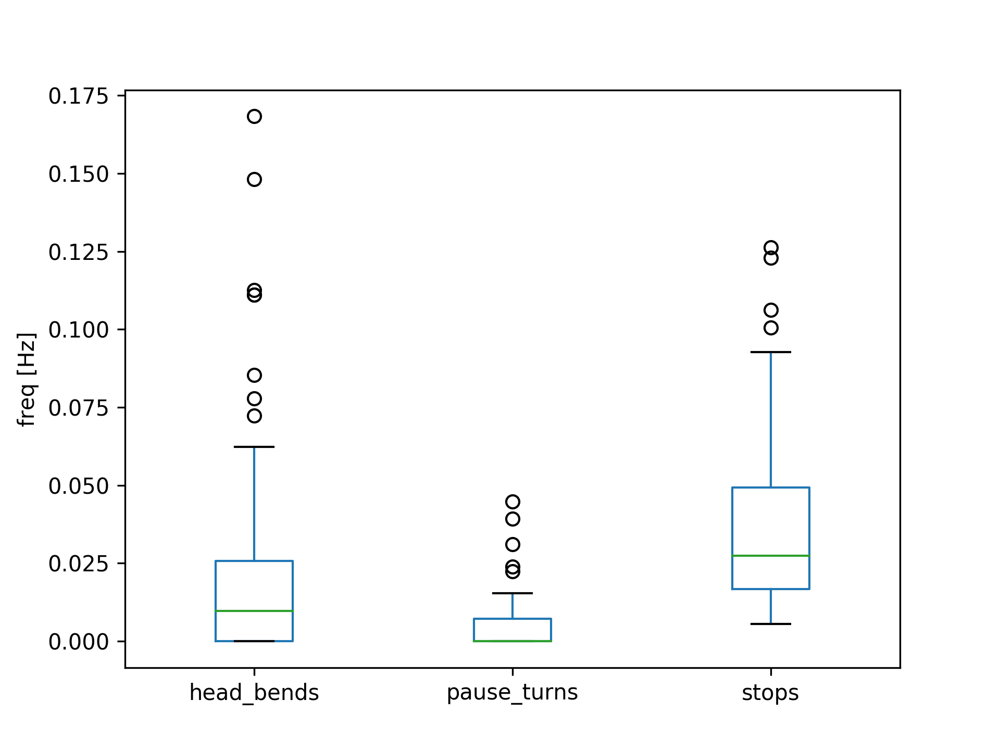

.. _example:

Introduction
************
This section will teach you the basics of how to use pyFIM.

Experiments and Collections
---------------------------
Everython in pyFIM is done by two basic classes: :class:`~pyfim.Experiment`
and :class:`~pyfim.Collection`.

:class:`pyfim.Experiment` extracts data from .csv files, does analyses and
helps you access each parameter. The idea is that you divide data from e.g.
different genotypes into an Experiment each.

As soon as you initialize an Experiment, data is extracted, processed and
additional analyses are run. Data clean up involves:

- removal of objects with too few data points
- filling of gaps in thresholded parameters
- conversion from pixel to mm/mm^2 (optional)
- remove frames at the beginning or end of the tracks

You can fine tune how this and the analyses are done by changing the defaults
in `config.py`. Please note that changes to the `config.py` will only take
effect if you restart your Python session. On the fly, you can change the
defaults by e.g.

>>> pyfim.defaults['PIXEL_PER_MM'] = 300

See the Configuration section for details.

:class:`pyfim.Collection` keep track of your Experiments. Their job is to
generate data tables from attached Experiments collapsing data into
means per larva.

Both these classes generate pandas DataFrames for the data and facilitate
juggling it. I highly recommend getting familiar with pandas:

- `pandas tutorials <https://pandas.pydata.org/pandas-docs/stable/tutorials.html>`_
- `pandas visualization <https://pandas.pydata.org/pandas-docs/stable/visualization.html>`_

Learning by doing
-----------------
Let's start off with a simple case: exploring a single `Experiment`.

>>> import pyfim
>>> import matplotlib.pyplot as plt
>>> # Initialise an experiment using a single CSV file
>>> exp = pyfim.Experiment('/experiments/genotype1/exp1.csv')
... INFO  : Data clean-up dropped 51 objects and 0 frames (pyfim)

As you see, 51 objects were dropped during import. That's because, by default,
object tracks have to have at least 500 frames - if not they are dropped.

Next, get a summary and available parameters:

>>> print( exp )
... <class 'pyfim.core.Experiment'> with: 48 objects; 1800 frames.
... Available parameters: acc_dst, acceleration, area, bending,
... bending_strength, dst_to_origin, go_phase, head_bends, head_x, head_y,
... is_coiled, is_well_oriented, left_bended, mom_dst, mom_x, mom_y,
... mov_direction, pause_turns, perimeter, peristalsis_efficiency,
... peristalsis_frequency, radius_1, radius_2, radius_3, right_bended,
... spine_length, spinepoint_1_x, spinepoint_1_y, spinepoint_2_x,
... spinepoint_2_y, spinepoint_3_x, spinepoint_3_y, stops, tail_x, tail_y,
... velocity

Access to all these data tables is always the same:

>>> exp.acc_dst
...    object_1  object_100  object_101  object_102  object_103 \
... 0   0.00000     0.00000     0.00000     0.00000     0.00000
... 1   2.23607     0.00000     2.00000     1.00000     1.00000
... 2   3.65028     1.00000     3.41421     1.00000     3.23607
... 3   3.65028     2.00000     3.41421     2.41421     4.23607
... 4   4.65028     3.41421     4.41421     3.82843     4.23607
... ...

Let's do some plotting: traces over time

>>> ax = exp.plot_tracks()
>>> plt.show()

.. image:: img/tracks.png
   :width: 100 %
   :alt: Tracks
   :align: left

Access data tables. Please note that some data tables are 2 dimensional
(e.g. velocity) while others are 1 dimensional (e.g. pause_turns)

>>> velocity = exp.velocity
>>> pause_turns = exp.pause_turns

Get the mean over all objects tracked

>>> mean_velocity = exp.mean('velocity')

Alternatively (for 2 dimensional data tables)

>>> mean_velocity = exp.velocity.mean(axis=0)

The second way also lets you get other metrics

>>> max_velocity = exp.velocity.max(axis=0)

Get all means over all parameters

>>> all_means = exp.mean()

We can also access data by objects:

>>> # Get a list of all tracked objects
>>> exp.objects
... ['object_1',
... 'object_100',
... 'object_101',
... 'object_102',
... 'object_103',
... ...

Access all parameters for a single object:

>>> obj1_data = exp['object_1']

Plot velocity for the first 5 objects

>>> vel = exp.velocity.iloc[:,:5]
>>> # Smooth over 20 frames
>>> vel = vel.rolling(window=20).mean()
>>> # Plot over time
>>> ax = vel.plot(legend=False)
>>> ax.set_xlabel('frames')
>>> ax.set_ylabel('velocity')
>>> plt.show()

.. image:: img/velocity.png
   :width: 100 %
   :alt: Velocity over time
   :align: left

Plot some frequency parameters over all objects

>>> param_to_plot = ['head_bends','pause_turns','stops']
>>> ax = exp.mean().loc[param_to_plot].T.plot(kind='box')
>>> ax.set_ylabel('freq [Hz]')
>>> plt.show()

Next, lets have a look at `Collections`:

>>> import pyfim
>>> import matplotlib.pyplot as plt

>>> # Initialize Experiments from CSV files in two folders
>>> exp1_folder = '/experiments/genotype1'
>>> exp2_folder = '/experiments/genotype2'
>>> exp1 = pyfim.Experiment(exp1_folder)
>>> exp2 = pyfim.Experiment(exp2_folder)

Initialise a Collection and add the Experiments

>>> coll = pyfim.Collection()
>>> coll.add_data(exp1, label='genotypeI')
>>> coll.add_data(exp2, label='genotypeII')

Get a summary of the Collection

>>> coll
... <class 'pyfim.core.Collection'> with 3 experiments:
...          name  n_objects  n_frames
... 0   genotypeI         46      1800
... 1   genotypeI         46      1800
... 2  genotypeII         47      1800
... Available parameters: tail_x, mom_dst, acc_dst, is_well_oriented, spinepoint_3_y, spine_length, right_bended, spinepoint_1_x, radius_2, peristalsis_frequency, radius_1, acceleration, spinepoint_1_y, area, head_bends, spinepoint_2_y, mom_y, go_phase, peristalsis_efficiency, bending_strength, spinepoint_2_x, tail_y, spinepoint_3_x, velocity, perimeter, pause_turns, head_x, mov_direction, left_bended, dst_to_origin, bending, head_y, is_coiled, radius_3, mom_x, stops

Get and plot a single parameter

>>> mean_acc_dst = coll.acc_dst
>>> ax = mean_acc_dst.plot(kind='box')
>>> ax.set_ylabel('accumulated distance')
>>> plt.show()

.. image:: img/acc_dst.png
   :width: 100 %
   :alt: Box plot of parameters
   :align: left

Collections have a built-in plotting function that lets you plot multiple
parameters as boxplots

>>> ax = coll.plot(['head_bends','pause_turns','stops'])
>>> plt.show()

.. image:: img/multi_box.png
   :width: 100 %
   :alt: Box plot of parameters
   :align: left

A special case: Two-Choice Experiments
--------------------------------------
In two-choice experiments objects can be split into two groups based on some
parameter. Classically, you would have setup in which half the arena has
different conditions than the other. For example: light vs dark or hot vs cold.
For this kind of experiment you might want to:

1. Quantify how objects distribute by calculating a preference index (PI)
2. Look at individual parameters separated by which side they are on.

For this, you can use the :class:`~pyfim.TwoChoiceExperiment`. This class
inherits from :class:`~pyfim.Experiment` - so it can do all of the stuff the
base class can plus some additional stuff like calculating a PI.

An example:

>>> # Set split to be made along x-axis (default)
>>> pyfim.defaults['TC_PARAM'] = 'mom_x'
>>> # Set where to make the split in pixel or mm
>>> pyfim.defaults['TC_BOUNDARY'] = 1000
>>> # Create two-choice experiment
>>> tc_exp = pyfim.TwoChoiceExperiment( '/2choice-experiments/1/' )
>>> # Get preference index (PI)
>>> tc_exp.preference_index
... 0.8712
>>> # Plot PI over time
>>> tc_exp.PI_over_time.plot()
>>> # Compare other parameters between left and right side of the experiment
>>> comp = tc_exp.split_data()
>>> comp.velocity.plot()

Reference
=========

.. autosummary::
    :toctree: generated/

    ~pyfim.Experiment
    ~pyfim.Collection
    ~pyfim.TwoChoiceExperiment